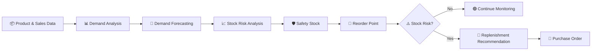
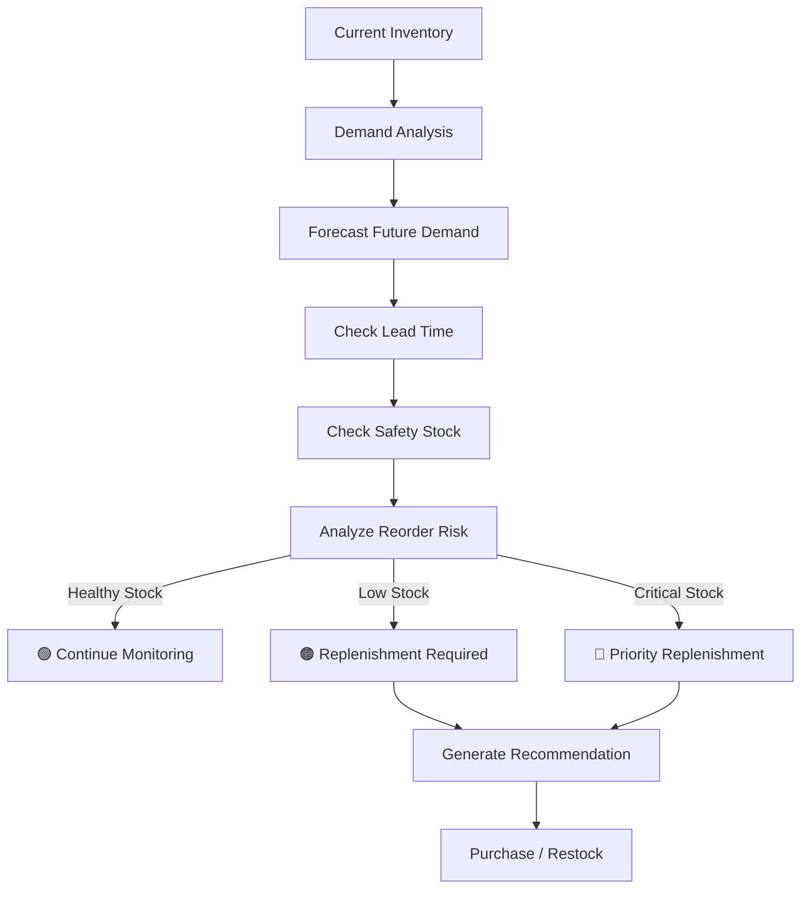
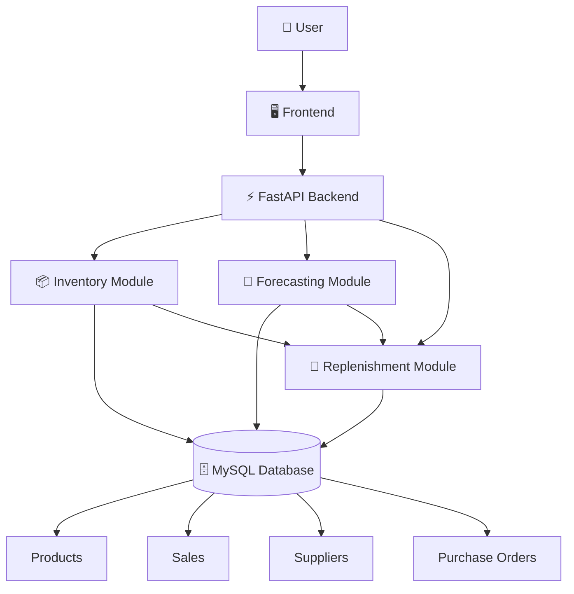
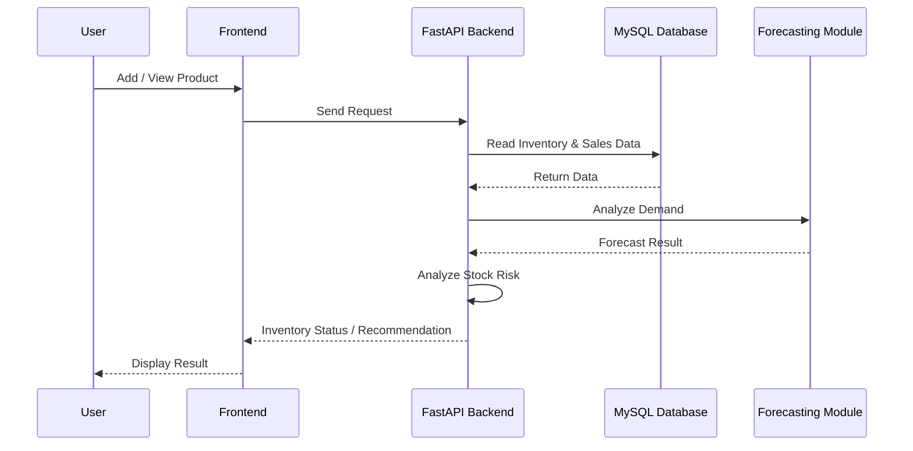

# 📦 Auto Inventory — Smart Replenishment System

<p align="center">
  <h1 align="center">Auto Inventory — Smart Replenishment</h1>
  <p align="center">
    A smart inventory management system for demand forecasting, stock monitoring,
    low-stock detection and automated replenishment recommendations.
  </p>
</p>

---

## 📌 Overview

**Auto Inventory — Smart Replenishment System** is a web-based inventory management prototype designed to make stock management smarter and more efficient.

The system combines **inventory tracking, demand forecasting, safety stock analysis, reorder-point logic and replenishment recommendations** in a single platform.

Instead of relying completely on manual stock checking, the system analyzes available inventory and demand-related data to help identify potential stock risks and support timely replenishment decisions.

---

## 🎯 Problem Statement

Traditional inventory management can become difficult when the number of products increases.

Common problems include:

- 📉 Unexpected stock-outs
- 📦 Overstocking
- ⏳ Delayed replenishment
- 🔍 Manual stock monitoring
- 📊 Difficulty analyzing demand
- 🛡️ Maintaining appropriate safety stock
- 🚚 Considering supplier lead time while planning replenishment

A smarter system is needed to continuously monitor inventory and provide useful replenishment insights.

---

## 💡 Our Solution

Auto Inventory follows a complete inventory intelligence workflow:



---

## ⭐ Key Features

### 📦 Inventory Management
- Add and manage products
- Track current stock
- Track unit price
- Organize products by category
- Monitor stock status

### 🔮 Demand Forecasting
- Uses available sales/demand data
- Generates future demand estimates
- Supports short-term inventory planning
- Helps identify possible future stock pressure

### 🛡️ Safety Stock
The system considers safety stock while analyzing inventory risk so that available quantity does not fall unnecessarily close to a critical level.

### 📍 Reorder Point
The system uses inventory conditions, demand and lead-time information to determine when replenishment should be considered.

### 🔄 Smart Replenishment
When a stock risk is detected, the system can provide a replenishment recommendation based on relevant inventory parameters.

### 🧾 Purchase Order Tracking
The system includes purchase-order related data so replenishment activity can be tracked.

---

## 🧠 How the System Works



---

## 🏗️ System Architecture



---

## 🔄 Application Flow



---

## 📊 Inventory Decision Logic

| Parameter | Purpose |
|---|---|
| Current Stock | Shows the currently available quantity |
| Demand | Represents product consumption/sales |
| Forecast | Estimates future demand |
| Safety Stock | Provides an additional inventory buffer |
| Lead Time | Represents expected replenishment time |
| Reorder Point | Helps identify when replenishment should be considered |
| Order Quantity | Represents the recommended replenishment amount |

```text
                    ┌─────────────────┐
                    │  Current Stock  │
                    └────────┬────────┘
                             ↓
                    ┌─────────────────┐
                    │ Demand Analysis │
                    └────────┬────────┘
                             ↓
                    ┌─────────────────┐
                    │ Demand Forecast │
                    └────────┬────────┘
                             ↓
                 ┌───────────────────────┐
                 │ Safety Stock +        │
                 │ Lead Time Analysis    │
                 └───────────┬───────────┘
                             ↓
                    ┌─────────────────┐
                    │ Reorder Analysis │
                    └────────┬────────┘
                             ↓
                 ┌───────────┴───────────┐
                 ↓                       ↓
          🟢 Stock Healthy          ⚠️ Stock Risk
                 ↓                       ↓
           Keep Monitoring       Replenishment
                                      ↓
                              🛒 Recommendation
```

---

## 🛠️ Technology Stack

| Layer | Technology |
|---|---|
| Frontend | HTML5, CSS3, JavaScript |
| Backend | Python, FastAPI |
| Database | MySQL |
| ORM | SQLAlchemy |
| Data Processing | Pandas, NumPy |
| Forecasting | Machine Learning / Data-driven Forecasting |
| API Server | Uvicorn |
| Configuration | Python-dotenv |

---

## 📁 Project Structure

```text
auto-inventory/
│
├── backend/
│   ├── __init__.py
│   ├── database.py
│   ├── forecasting.py
│   ├── inventory.py
│   ├── main.py
│   ├── models.py
│   ├── replenishment.py
│   └── schemas.py
│
├── frontend/
│   ├── index.html
│   ├── script.js
│   └── style.css
│
├── .env.example
├── .gitignore
├── requirements.txt
└── README.md
```

---

## 🖥️ Screenshots

### 01


### 02 


### 03 


### 04 


### 05 


### 06 


### 07 


### 08 


### 09 


### 10 


---

## ⚙️ Installation & Setup

### 1. Clone the repository

```bash
git clone https://github.com/RohanGhosh2007/auto-inventory-smart-replenishment.git
cd auto-inventory-smart-replenishment
```

### 2. Install dependencies

```bash
pip install -r requirements.txt
```

### 3. Configure MySQL

Create the database:

```sql
CREATE DATABASE auto_inventory;
```

Create a `.env` file based on `.env.example`:

```env
DB_USER=root
DB_PASSWORD=your_password
DB_HOST=localhost
DB_PORT=3306
DB_NAME=auto_inventory
```

> ⚠️ Never upload your real `.env` file or database password to GitHub.

### 4. Start the backend

```bash
python -m uvicorn backend.main:app --reload
```

### 5. Open the application

```text
http://127.0.0.1:8000
```

FastAPI documentation:

```text
http://127.0.0.1:8000/docs
```

---

## 🧪 Example Inventory Scenario

```text
Current Stock   → 45 units
Safety Stock    → 50 units
Lead Time       → 4 days
Demand          → Increasing
Stock Status    → Low
```

The system can detect that the current stock has reached a risky level and generate a replenishment recommendation.

This allows the inventory manager to take action before the product reaches zero stock.

---

## 🔐 Security

Sensitive information such as:

- Database passwords
- `.env` files
- Local database files

should not be committed to the public repository.

---

## 🔮 Future Improvements

- ☁️ Cloud deployment
- 📱 Responsive mobile dashboard
- 🔔 Real-time inventory notifications
- 🧾 Automated purchase-order generation
- 📈 Advanced forecasting models
- 🏪 Multi-store inventory management
- 👥 Role-based authentication
- 📦 Supplier performance analysis
- 📊 Advanced business analytics
- 🔄 Automated replenishment workflows

---

## 🎯 Project Goals

The main goals of the project are to:

- Reduce stock-out risk
- Reduce unnecessary overstock
- Improve inventory visibility
- Support demand-based planning
- Automate repetitive inventory analysis
- Provide timely replenishment recommendations
- Create a scalable foundation for smart inventory management

---

## 👨‍💻 Project

**Auto Inventory — Smart Replenishment System**

Developed as a software prototype demonstrating inventory monitoring, demand forecasting and smart replenishment.

---

## 📄 License

This project is developed for educational and prototype purposes.
